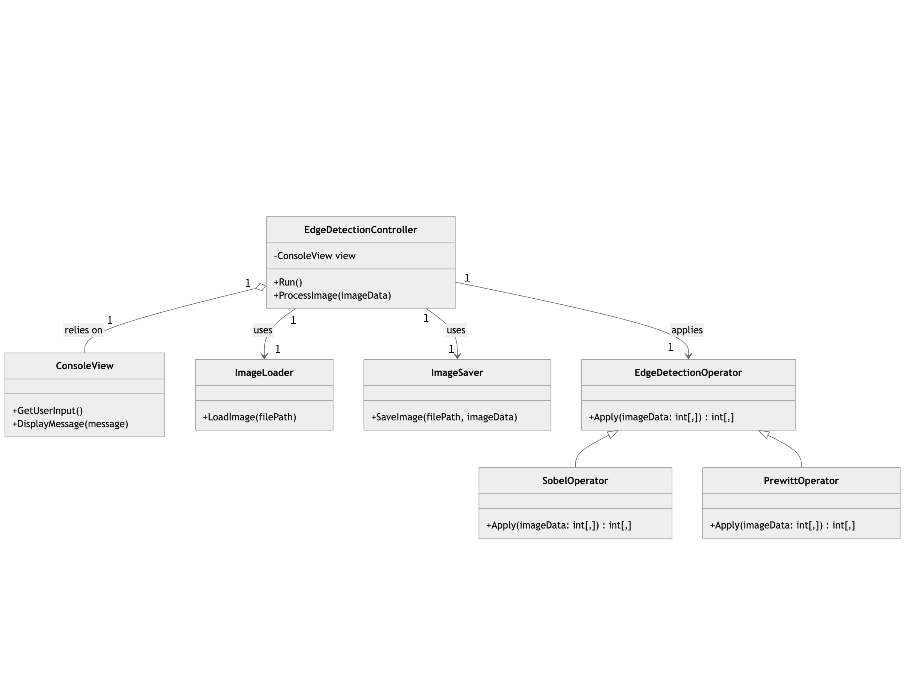

# Edge Detection in C#
Below is an example of the edge detection result:

| Input Image | Output Image |
|----------------------------------|----------------------------------|
|  |  |

## Overview
EdgeDet is a simple C# application for performing edge detection on grayscale images. It supports both Sobel and Prewitt operators for edge detection.

## Features
- Console-based user interaction.
- Supports Sobel and Prewitt edge detection algorithms.
- Easily extendable and testable codebase.

## Prerequisites
- .NET 9.0 SDK or newer.


## Installation and Setup
1. Clone the repository:
   ```bash
   git clone https://github.com/StevenZhangzhexu/EdgeDet.git
   cd EdgeDet
   ```

2. Build the project:
   ```bash
   dotnet build
   ```

3. Add your input image to the `image` folder. Ensure the image is in grayscale and provide the path when running the program. For example, for a `test.jpg` in the `image` folder, you should enter path `image/test.jpg`. If you want to try the default `sample.jpg`, there is no need to specify the input image path.

## Running the Application
1. Run the application using:
   ```bash
   dotnet run
   ```
2. Follow the on-screen instructions to:
   - Specify the image file path. (Optional)
   - Select the edge detection operator (Enter `sobel` or `prewitt`, default: `sobel`).
   - Provide the output file path.(Optional)
3. If the output file path is not specified, you can find the detected edges in  `image/output.jpg`

## Testing the Application
1. Navigate to the `EdgeDet.Tests` folder.
2. Run the tests:
   ```bash
   dotnet test
   ```

## UML Diagram
.

## Directory Structure
```
EdgeDet/
├── Controllers/
├── Models/
├── Utilities/
├── Views/
├── image/
│   ├── sample.jpg
│   └── ...
│   └── output.jpg
├── EdgeDet.csproj
├── EdgeDet.sln
├── bin/ (excluded from repository)
├── obj/ (excluded from repository)
└── README.md
```